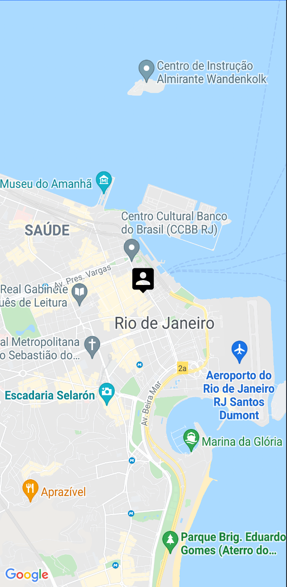
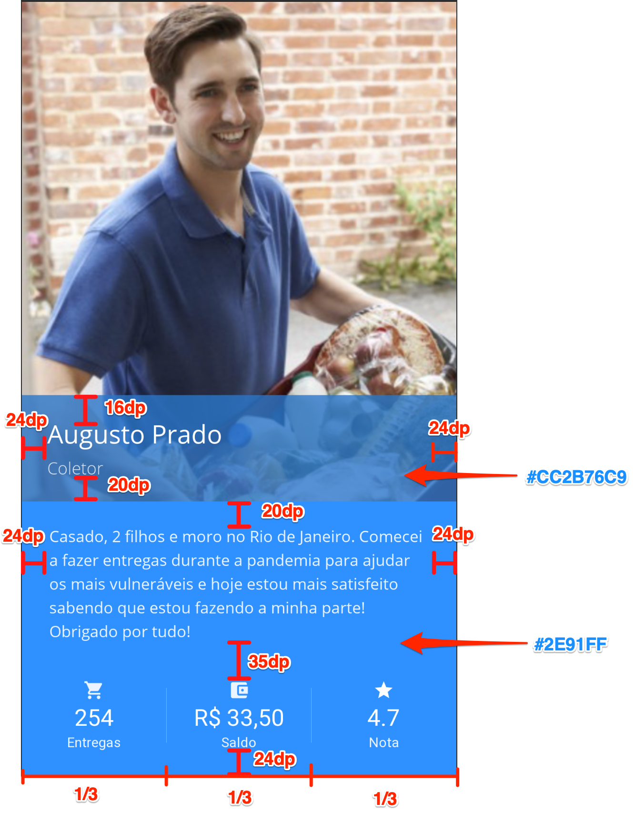
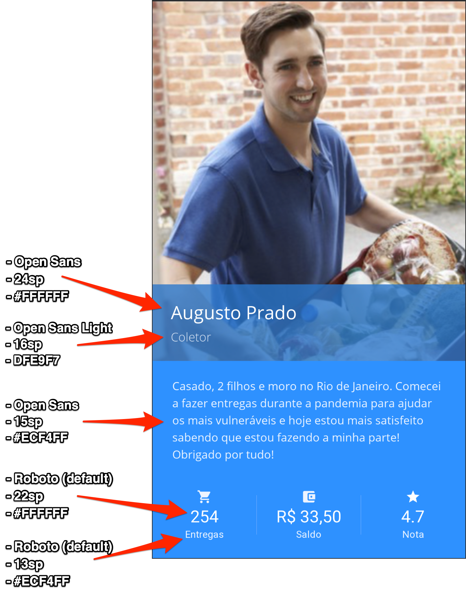

# Processo seletivo: Gaudium - Desenvolvedor Android
Bem vindo ao processo seletivo da Gaudium!

### Pré-requisitos
- Android Studio 3.5 ou superior
- Ter uma conta no GitHub
- Ter uma cópia deste repositório a partir do botão "Use this template" e convidar o usuário gaudiumtecnicos@gmail.com ao repositório criado
- Git instalado para fazer os commits do código no repositório próprio ao longo da prova
    - Caso tenha dificuldades, recomendamos usar o GitHub Desktop
- Internet estável 

## Novo aplicativo de entregas
Um empresário interessado em atuar no ramo de delivery quer lançar seu próprio app no mercado e dominar as entregas de sua região. Ele tentou fazer o aplicativo por conta própria e após muito sofrimento conseguiu fazer uma tela com apenas um mapa e um marcador nele. Maravilhado com o progresso, ele imediatamente decidiu desistir de ser desenvolvedor e contratou a Gaudium para não ter que lidar com código novamente e poder focar no lançamento da marca.

Sua estratégia de lançamento é focar no destaque para o entregador, então quer que a primeira funcionalidade implementada seja uma tela de perfil com os dados recebidos de um banco de dados.

## Introdução

### O código atual
O código segue o modelo MVP padrão do Android e possui apenas uma tela, a MapsActivity, que apenas instancia um mapa do Google Maps e exibe um marcador no centro do Rio de Janeiro. 



Existem alguns códigos irrelevantes no projeto, inclusive dentro da própria MapsActivity. **Você não precisa se preocupar com eles.**

## O desafio
### Instruções
Você deverá clonar o repositório atual em um repositório próprio.
Além disso, deverá convidar o usuário `gaudiumtecnicos@gmail.com` para o seu repositório que ficará com o código da prova.
Ao final de cada item concluído você deverá fazer um commit da alteração e, na descrição do commit, explicar o que foi feito e qual foi a motivação para as decisões tomadas. Após realizar o commit, **não se esqueça de fazer o push.**

### Etapa zero
Alterar o marcador do usuário para que ele fique com o fundo branco. O marcador atual é o `pin_user.xml`, que possui um fundo transparente. A primeira tarefa será trocar o `pin_user.xml` pelo `pin_user_white.xml`, que é melhor de visualizar no mapa.
Ao finalizar essa etapa inicial, vamos fazer um commit deixando claro qual etapa resolvemos e, na descrição, explicar como chegou na solução enviada.
Ex: 

> **Summary:** Etapa zero: Mudança de imagem utilizada no pin do usuário

> **Description:** Como foi solicitado pelo cliente a troca de uma imagem com um nome específico, procurei pelo código qualquer referência à essa imagem, "pin_user", e alterei onde foi encontrado, conforme o solicitado.

### Etapa 1 - Tela para mostrar os dados do entregador e o histórico
O cliente deseja que os entregadores possam verificar o seu perfil, e que nela exiba algumas estatísticas como a quantidade de entregas, saldo e nota média. Nesta etapa seu trabalho será de criar essa tela de acordo com um layout e depois preencher com os dados desejáveis obtidos através de uma api.

#### 1.1 Como devo chegar nessa tela? <!-- 10 minutos -->
Inserir em algum lugar da tela principal do app uma forma de acessar essa nova tela de perfil. Colocar no lugar que você achar mais interessante pro usuário final (entregador) acessar.

#### 1.2 Tela de perfil do entregador <!-- 60 minutos -->
Criar a tela de Perfil conforme a imagem abaixo:


    
A tela possui as seguintes regras:
- Os dados são exibidos no final da tela
- A foto do entregador preenche o espaço faltante entre o topo da tela até a view contendo a descrição do perfil, ficando atrás da view semi-transparente. 
- A foto do entregador será fixa e já está presente no projeto com o nome `img_entregador.png`
- Os 3 indicadores inferiores ocupam igualmente toda a largura da tela, e cada um está centralizado dentro de seu espaço. Entre eles existe uma view de `3px` na cor `#82B4FE`.
- As imagens utilizadas pelos 3 indicadores já estão presentes no projeto e podem ser encontradas a partir dos nomes, na ordem de exibição da imagem:
     - `ic_entregas.xml`
     - `ic_saldo.xml`
     - `ic_nota.xml`
- As margens relevantes estão especificados na imagem abaixo. Caso alguma margem não esteja definida, fique à vontade para decidir a mais apropriada.



As cores utilizadas pelos menus são as seguintes:
- View semi-transparente: `#CC2B76C9`
- View inferior: `#2E91FE`
- Separador entre as estatísticas: `#82B4FE`

Para os textos da tela, seguem as fontes e tamanhos que devem ser utilizados:
- O nome do entregador (Augusto Prado) usa a fonte `open_sans`, já existente no projeto, com tamanho de `24sp` na cor `#FFFFFF`
- O cargo (Coletor) usa a fonte `open_sans_light`, já existente no projeto, com tamanho `16sp` na cor `#DFE9F7`
- A descrição do perfil usa a fonte `open_sans`, já existente no projeto, com tamanho `15sp` na cor `#ECF4FF`. O espaço entre as linhas da descrição possuem um espaçamento extra de `2dp`
- Para os 3 indicadores inferiores:
    - O número deverá utilizar a fonte `roboto`, default do android, com tamanho `22sp` e cor `#FFFFFF`
    - O nome do indicador deverá utilizar a fonte `roboto`, default do android, com tamanho `13sp` e cor `#ECF4FF`
     


#### 1.3 Perfil hard-coded não faz sentido <!-- 30 minutos -->
Já pensou em gerar 1 app para cada usuário? Vai dar trabalho e não é escalável. Sendo assim, você deve consumir a API `/ps/perfil` para obter os dados referentes a esse entregador (nome, cargo, descrição) e preencher nos devidos locais da tela.

A API `/ps/perfil` retorna os seguintes dados:
- `success`, indicando se funcionou ou não
- `response`, com os dados solicitados
- `nome`, com o nome do entregador
- `cargo`, com o cargo referente ao entregador
- `descricao`, texto contendo a descrição do perfil
- `historico`, que é um array de histórico (sem limite de elementos). Cada elemento no array de histórico possui os seguintes atributos:
    - `quando`, com a data da entrega realizada
    - `valor`, em float, com quanto ganhou nessa entrega
    - `qtd`, em int, com o número de entregas que fez no pedido
    - `avaliacao`, em int, com a nota recebida pela entrega realizada

Segue a estrutura:
url: https://dbgapi-desenv.taximachine.com.br/ps/perfil.php
```json
{
    "success":"<String contendo "true" ou "false">",
    "response":{
        "nome":"<String com nome do entregador>",
        "cargo":"<String com nome do cargo do entregador>",
        "descricao":"<String com a descrição do perfil>",
        "historico":[
            {
                "quando":"<String com a data da entrega>",
                "valor":"<Float com o valor ganho pela entrega>",
                "qtd":"<Integer com a quantidade de produtos entregues na entrega>",
                "avaliacao":"<Integer com a avaliação recebida pela entrega>"
             },
             {
                "quando":"<String com a data já pronta para visualização>",
                "valor":"<Float com o valor ganho pela entrega>"
            },
            ...
        ]
    }
}
```

### Etapa 2 - As estatísticas precisam ser calculadas <!-- 20 minutos -->

#### Verificar dados recebidos e preencher as estatísticas

Se olhar para a resposta da API, não vão ter informações claras sobre saldo, avaliação do motorista e nem quantidade total de entregas, mas tem o histórico dele. A partir dos dados recebidos no histórico, calcule e preencha os seguintes indicadores:
- Quantidade total de produtos entregues
- Média de avaliações das entregas
- Saldo, em reais, com o total recebido.
  - O valor deverá ser formatado para ser exibido de acordo com as regras da moeda Real.
    
 <!-- Total até aqui: 120 min -->
## Conclusões

- Não existe uma forma específica de resolver cada questão. Veja o que você considera como melhor solução considerando a qualidade do resultado e o tempo restante.
- A prova deverá ser realizada com a câmera ligada e microfone no mudo.
- Vocês podem se ausentar sem precisar pedir permissão, apenas fiquem atentos ao tempo restante.
- Em caso de dúvidas, tire o microfone do mudo e chame o responsável pela prova.
  - Caso o responsável não esteja presente no momento, levante a mão pelo Google Meet para que fique sinalizado a dúvida.
- Quando faltarem 20 minutos para terminar a prova, vocês serão notificados pelo revisor. Caso veja que não vai dar tempo, deixe o máximo de comentários indicando quais seriam os próximos passos para concluir cada questão.

E mais importante, boa sorte e boa prova! :)
